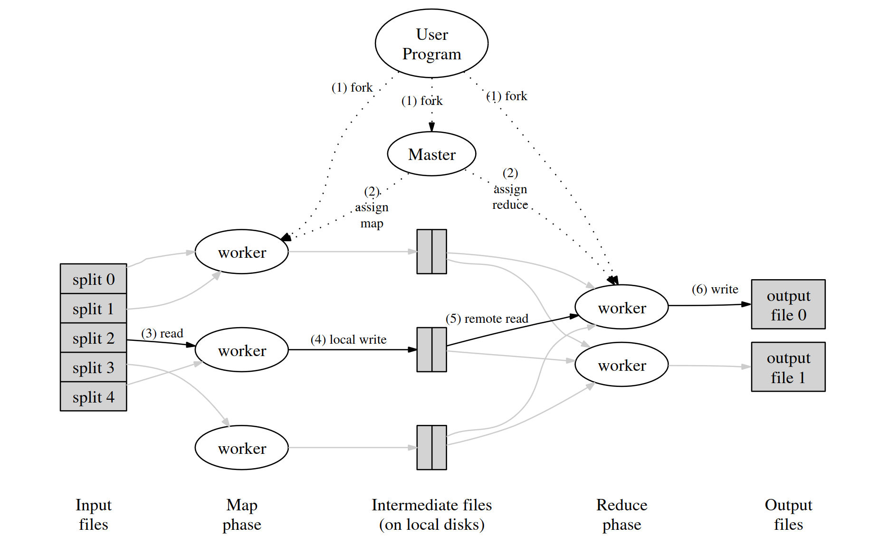

## MapReduce

MapReduce 是一种编程模型，其思想是让程序员通过编写简单的 Map 和 Reduce 程序就能完成分布式系统的任务，而不需要关注分布式的具体细节。

用户自定义的Map函数接受一个 key/value pair 的输入值，然后产生一个中间 key/value pair 值的集合。MapReduce 库把所有具有相同中间 key 值 I 的中间 value 值集合在一起后传递给 Reduce 函数。

用户自定义的 Reduce 函数接受一个中间 key 的值 I 和相关的一个 value 值的集合。Reduce 函数合并这些 value 值，形成一个较小的 value 值的集合。通常来说，每次 Reduce 函数调用只产生 0 或 1 个输出 value 值。通常我们通过一个迭代器把中间 value 值提供给 Reduce 函数，这样我们就可以处理无法全部放入内存中的大量的 value 值的集合(迭代器可看为一个容器,所以数据放入一个容器中，Reduce 函数就从这个容器中取数据即可)。

例如：计算一个大的文档集合中每个单词出现的次数，Map 和 Reduce 伪代码如下：

```c
map(String key, String value) {
// key: document name
// value: document contents
for each word w in value:
EmitIntermediate(w, "1");
}

reduce(String key, Iterator values) {
// key: a word
// values: a list of counts
int result = 0;
for each v in values:
result += ParseInt(v);
Emit(AsString(result));
}
```

## MapReduce 框架原理

论文中描述的 MapReduce 框架的具体原理如下：



当用户程序调用 MapReduce 时，会发生下面一系列动作：

- 用户程序首先调用的 MapReduce 库将输入文件分成M个数据片度，每个数据片段的大小一般从 16MB 到 64MB (可以通过可选的参数来控制每个数据片段的大小)。然后用户程序在机群中创建大量的程序副本。

- 这些程序副本中的有一个特殊的程序 master。副本中其它的程序都是 worker 程序，由 master 分配任务。有 M 个 Map 任务和 R 个 Reduce 任务将被分配，master 将一个 Map 任务或 Reduce 任务分配给一个空闲的 worker。

- 被分配了 map 任务的 worker 程序读取相关的输入数据片段，从输入的数据片段中解析出 key/value pair，然后把 key/value pair 传递给用户自定义的 Map 函数，由 Map函数生成并输出的中间k ey/value pair，并缓存在内存中。

- 缓存中的 key/value pair 通过分区函数分成 R 个区域，之后周期性的写入到本地磁盘上。缓存的 key/value pair 在本地磁盘上的存储位置将被回传给 master，由 master 负责把这些存储位置再传送给 Reduce worker。

- 当 Reduce worker 程序接收到 master 程序发来的数据存储位置信息后，使用 RPC 从 Map worker 所在主机的磁盘上读取这些缓存数据。当 Reduce worker 读取了所有的中间数据后，通过对 key 进行排序后使得具有相同 key 值的数据聚合在一起。由于许多不同的 key 值会映射到相同的 Reduce 任务上，因此必须进行排序。如果中间数据太大无法在内存中完成排序，那么就要在外部进行排序。

- Reduce worker 程序遍历排序后的中间数据，对于每一个唯一的中间 key 值，Reduce worker 程序将这个 key 值和它相关的中间 value 值的集合传递给用户自定义的 Reduce函数。Reduce 函数的输出被追加到所属分区的输出文件。

- 当所有的 Map 和 Reduce 任务都完成之后，master 唤醒用户程序。在这个时候，在用户程序里的对 MapReduce 调用才返回。

## First step

在一开始，目标是至少先让代码跑起来。

首先看懂 mrsequential.go 的逻辑，看懂 coordinator 和 worker 的 rpc 交互流程。然后实现 coordinator 分配任务后 worker 直接把任务打印出来。

worker 通过 rpc 调用 coordinator 的 AssignJob 方法，获取任务，然后直接打印出来。

在 rpc.go 中，定义用到的 rpc 相关的结构体：

```go
type JobType int

const (
    Map JobType = iota
    Reduce
)

// worker ask for a job
type JobArgs struct{}

// the coordinator reply for the job
type JobReply struct {
    JobArgs interface{}
    JobType JobType 
}
```

**coordinator.go**

```go
type JobType int

const (
    Map JobType = iota
    Reduce
)

// worker ask for a job
type JobArgs struct{}

// the coordinator reply for the job
type JobReply struct {
    JobArgs interface{}
    JobType JobType
}

func (c *Coordinator) AssignJob(args *JobArgs, reply *JobReply) error {
    if c.assigned < len(c.files) {
        reply.JobArgs = c.files[c.assigned]
        c.assigned++
        reply.JobType = Map
    } else {
        reply.JobType = Reduce
        c.nReduce--
    }
    return nil
}
```

**worker.go**

```go
func Worker(mapf func(string, string) []KeyValue,
    reducef func(string, []string) string,
) {
    args := new(JobArgs)
    reply := new(JobReply)
    ok := call("Coordinator.AssignJob", &args, &reply)
    if !ok {
        fmt.Println("call failed!")
        return
    } else {
        switch reply.JobType {
        case Map:
            file := reply.JobArgs
            fmt.Println("Map: ", file)
        case Reduce:
            fmt.Println("Reduce: ", reply.JobArgs)
        }
    }
}
```

## 初步实现（暂不考虑worker出现故障、超时以及一些并发引起的问题，先实现成功调用用户 Map 和 Reduce 方法）

定义结构体用于传递 Map 和 Reduce 需要的参数

```go
type MapWorkerArgs struct {
    Files    []string
    WorkerId int // worker id
    NReduce  int // number of reduce workers
}

type ReduceWorkerArgs struct {
    WorkerId int // worker id
}
```

- 暂时考虑对整个 AssignJob 加互斥锁，若发现这样加锁不能满足要求再行改进。

- Map worker 将中间文件的文件名传递给 coordinator。

- coordinator 将需要 Reduce worker 处理的中间文件的文件名传递给对应的 Reduce worker。

**rpc.go**

```go
package mr

//
// RPC definitions.
//
// remember to capitalize all names.
//

import (
    "os"
    "strconv"
)

// Add your RPC definitions here.

// the job type enum, Map and Reduce
type JobType int

const (
    Map JobType = iota
    Reduce
)

// worker ask for a job
type JobArgs struct{}

// the coordinator reply for the job
type JobReply struct {
    JobType    JobType
    MapArgs    MapWorkerArgs
    ReduceArgs ReduceWorkerArgs
}

type PassFileNamesArgs struct {
    IntermediateFileNames []string
}

type PassFileNamesReply struct{}

// Cook up a unique-ish UNIX-domain socket name
// in /var/tmp, for the coordinator.
// Can't use the current directory since
// Athena AFS doesn't support UNIX-domain sockets.
func coordinatorSock() string {
    s := "/var/tmp/5840-mr-"
    s += strconv.Itoa(os.Getuid())
    return s
}
```

**coordinator.go**

```go
package mr

import (
    "fmt"
    "log"
    "net"
    "net/http"
    "net/rpc"
    "os"
    "sync"
)

type Coordinator struct {
    files           []string
    assigned        int // number of files assigned
    nReduce         int // number of reduce workers
    mapWorkerNum    int // number of map workers created
    reduceWorkerNum int // number of reduce workers created
    // the file names of the intermediate files
    // index i is for the No.i Reduce worker
    intermediateFileNames [][]string
    mutexLock             sync.Mutex
}

// the arguments to pass to the mapWorker
type MapWorkerArgs struct {
    File     string
    WorkerId int // worker id
    NReduce  int // number of reduce workers
}

// the arguments to pass to the reduceWorker
type ReduceWorkerArgs struct {
    WorkerId              int      // worker id
    IntermediateFileNames []string // files for reduce workers to work on
}

// Your code here -- RPC handlers for the worker to call.

func (c *Coordinator) GetJob(args *JobArgs, reply *JobReply) error {
    c.mutexLock.Lock()
    defer c.mutexLock.Unlock()
    if c.assigned < len(c.files) {
        reply.MapArgs.WorkerId = c.mapWorkerNum
        reply.MapArgs.File = c.files[c.assigned]
        reply.MapArgs.NReduce = c.nReduce
        c.mapWorkerNum++
        c.assigned++
        reply.JobType = Map
    } else if c.nReduce > c.reduceWorkerNum {
        reply.JobType = Reduce
        reply.ReduceArgs.WorkerId = c.reduceWorkerNum
        reply.ReduceArgs.IntermediateFileNames = c.intermediateFileNames[c.reduceWorkerNum]
        c.reduceWorkerNum++
    } else {
        fmt.Println("All Reduce workers are already assigned")
    }
    return nil
}

func (c *Coordinator) PassFileNames(args *PassFileNamesArgs, reply *PassFileNamesReply) error {
    c.mutexLock.Lock()
    defer c.mutexLock.Unlock()
    intermediateFileNames := args.IntermediateFileNames
    for i, intermediateFileName := range intermediateFileNames {
        c.intermediateFileNames[i] = append(c.intermediateFileNames[i], intermediateFileName)
    }
    return nil
}

func (c *Coordinator) server() {
    rpc.Register(c)
    rpc.HandleHTTP()
    // l, e := net.Listen("tcp", ":1234")
    sockname := coordinatorSock()
    os.Remove(sockname)
    l, e := net.Listen("unix", sockname)
    if e != nil {
        log.Fatal("listen error:", e)
    }
    go http.Serve(l, nil)
}

// main/mrcoordinator.go calls Done() periodically to find out
// if the entire job has finished.
func (c *Coordinator) Done() bool {
    ret := false

    // Your code here.

    return ret
}

// create a Coordinator.
// main/mrcoordinator.go calls this function.
// nReduce is the number of reduce tasks to use.
func MakeCoordinator(files []string, nReduce int) *Coordinator {
    c := Coordinator{}

    // Your code here.
    c.assigned = 0
    c.files = files
    c.mapWorkerNum = 0
    c.reduceWorkerNum = 0
    c.nReduce = nReduce
    c.intermediateFileNames = make([][]string, nReduce)

    c.server()
    return &c
}
```

**worker.go**

```go
package mr

import (
    "encoding/json"
    "fmt"
    "hash/fnv"
    "io"
    "log"
    "net/rpc"
    "os"
    "plugin"
    "sort"
)

// Map functions return a slice of KeyValue.
type KeyValue struct {
    Key   string
    Value string
}

// for sorting by key.
type ByKey []KeyValue

// for sorting by key.
func (a ByKey) Len() int           { return len(a) }
func (a ByKey) Swap(i, j int)      { a[i], a[j] = a[j], a[i] }
func (a ByKey) Less(i, j int) bool { return a[i].Key < a[j].Key }

// use ihash(key) % NReduce to choose the reduce
// task number for each KeyValue emitted by Map.
func ihash(key string) int {
    h := fnv.New32a()
    h.Write([]byte(key))
    return int(h.Sum32() & 0x7fffffff)
}

// load the application Map and Reduce functions
// from a plugin file, e.g. ../mrapps/wc.so
func loadPlugin(filename string) (func(string, string) []KeyValue, func(string, []string) string) {
    p, err := plugin.Open(filename)
    if err != nil {
        log.Fatalf("cannot load plugin %v", filename)
    }
    xmapf, err := p.Lookup("Map")
    if err != nil {
        log.Fatalf("cannot find Map in %v", filename)
    }
    mapf := xmapf.(func(string, string) []KeyValue)
    xreducef, err := p.Lookup("Reduce")
    if err != nil {
        log.Fatalf("cannot find Reduce in %v", filename)
    }
    reducef := xreducef.(func(string, []string) string)

    return mapf, reducef
}

func mapWorker(args MapWorkerArgs) {
    nReduce := args.NReduce
    file, err := os.Open(args.File)
    if err != nil {
        log.Fatalf("cannot open %v", args.File)
    }
    content, err := io.ReadAll(file)
    if err != nil {
        log.Fatalf("cannot read %v", args.File)
    }
    file.Close()
    mapf, _ := loadPlugin(os.Args[1])
    kva := mapf(args.File, string(content))
    // divide the key value pairs for each reduce workers
    kvalist := make([][]KeyValue, nReduce)
    intermediateFileNameList := make([]string, nReduce)
    for _, kv := range kva {
        num := ihash(kv.Key) % nReduce // the reduce task number for the KeyValue pair
        kvalist[num] = append(kvalist[num], kv)
    }
    // write the divided key value pairs to disk
    for i, kva := range kvalist {
        intermediateFileName := fmt.Sprintf("mr-%d-%d", args.WorkerId, i)
        intermediateFileNameList[i] = intermediateFileName
        intermediateFile, err := os.Create(intermediateFileName)
        if err != nil {
            log.Fatalf("cannot create %v", intermediateFileName)
        }
        enc := json.NewEncoder(intermediateFile)
        for _, kv := range kva {
            err := enc.Encode(&kv)
            if err != nil {
                log.Fatalf("cannot encode %v", kv)
            }
        }
    }
    // pass the address (file name) of the key value pairs file to the master
    pargs := new(PassFileNamesArgs)
    preply := new(PassFileNamesReply)
    pargs.IntermediateFileNames = intermediateFileNameList
    ok := call("Coordinator.PassFileNames", &pargs, &preply)
    if !ok {
        fmt.Println("call PassFileNames failed")
    }
}

func reduceWorker(args ReduceWorkerArgs) {
    intermediateFileNames := args.IntermediateFileNames
    _, reducef := loadPlugin(os.Args[1])
    intermediate := make([]KeyValue, 0)
    // read key value pairs from intermediate files
    for _, fileName := range intermediateFileNames {
        intermediateFile, err := os.Open(fileName)
        if err != nil {
            log.Fatalf("cannot open %v", fileName)
        }
        dec := json.NewDecoder(intermediateFile)
        for {
            var kv KeyValue
            if err := dec.Decode(&kv); err != nil {
                break
            }
            intermediate = append(intermediate, kv)
        }
        intermediateFile.Close()
    }
    sort.Sort(ByKey(intermediate))
    // create output file
    oname := fmt.Sprintf("mr-out-%v", args.WorkerId)
    ofile, _ := os.Create(oname)
    //
    // call Reduce on each distinct key in intermediate[],
    // and print the result to ofile
    //
    i := 0
    for i < len(intermediate) {
        j := i + 1
        for j < len(intermediate) && intermediate[j].Key == intermediate[i].Key {
            j++
        }
        values := []string{}
        for k := i; k < j; k++ {
            values = append(values, intermediate[k].Value)
        }
        output := reducef(intermediate[i].Key, values)

        // this is the correct format for each line of Reduce output.
        fmt.Fprintf(ofile, "%v %v\n", intermediate[i].Key, output)

        i = j
    }
}

// main/mrworker.go calls this function.
func Worker(mapf func(string, string) []KeyValue,
    reducef func(string, []string) string,
) {
    args := new(JobArgs)
    reply := new(JobReply)
    ok := call("Coordinator.GetJob", &args, &reply)
    if !ok {
        fmt.Println("call GetJob failed!")
        return
    } else {
        switch reply.JobType {
        case Map:
            fmt.Printf("Running Map No.%d\n", reply.MapArgs.WorkerId)
            mapWorker(reply.MapArgs)
        case Reduce:
            fmt.Printf("Running Reduce No.%d\n", reply.ReduceArgs.WorkerId)
            reduceWorker(reply.ReduceArgs)
        }
    }
}

// send an RPC request to the coordinator, wait for the response.
// usually returns true.
// returns false if something goes wrong.
func call(rpcname string, args interface{}, reply interface{}) bool {
    // c, err := rpc.DialHTTP("tcp", "127.0.0.1"+":1234")
    sockname := coordinatorSock()
    c, err := rpc.DialHTTP("unix", sockname)
    if err != nil {
        log.Fatal("dialing:", err)
    }
    defer c.Close()

    err = c.Call(rpcname, args, reply)
    if err == nil {
        return true
    }

    fmt.Println(err)
    return false
}
```

## 对故障和超时的 worker 的识别和处理，以及一些并发相关问题的解决

- 对每一个 worker，coordinator 在分配了任务之后等待10秒，若超出10秒 worker 没有完成任务，就把这个 worker 视为 crashed，将任务分配给其他的 worker。

- Reduce worker 需要等 Map 全部完成才能开始，在 Map 全部结束之前，利用 channel 阻塞 Reduce worker 的 RPC 调用。

- 定义两个数组用来显示 map 和 reduce 任务的完成情况。两个 int 类型的变量记录尚未完成的 map 和 reduce 任务的数量，Done 函数通过判断这两个变量来判断 coordinator 任务是否结束。

- 利用 channel 作为队列，在 coordinator 中定义两个队列，用于存放后面等待分配的 map 和 reduce 任务。分配之后 coordinator 等待10秒，10 秒后任务没有完成就重新把任务放进队列中。

- coordinator 在完成对 worker 的调用后新建一个 go routine，等待10秒后判断任务是否已经完成。

- worker 在任务成功完成后调用一个 RPC 函数告知 coordinator 任务已完成。

## 一些注意事项（踩过的坑）

- 在编写程序时注意函数和变量以大写开头和以小写开头的区别，RPC 模块涉及到的所有函数，传递的变量（包括结构体内部的变量）开头字母都要大写。

- 使用 go run -race 来检测并发相关的问题。

- 注意，worker 在执行完一个任务之后应该继续向 coordinator 请求下一个任务，而不是直接返回。

- 在 worker 中 sleep 一小段时间来避免所有任务被一个 worker 请求而不能通过 parallelism test。

- Reduce worker 读取中间文件失败不需要退出，直接尝试读取下一个文件，Map worker 确实可能对于某个 Reduce worker 不产生中间文件。

- 由于可能会有一些 worker 速度慢，并未 crash 而只是超时，所以会出现一个任务由不同的 worker 先后完成，而向 coordinator 先后多次传递任务完成的信息。所以对于记录剩余未完成的任务的数量的变量，不能收到完成消息后简单减一。

- 加了锁的函数要注意防止死锁。如 coordinator 的 GetJob 函数中，如果 channel 队列此时为空，会阻塞直到有下一个数进入队列，但若阻塞时互斥锁是 lock 的状态，下一个数进入队列的程序段也加上了锁，将会出现死锁。事实上 GetJob 函数无需加锁。

## 一个调试了挺久的问题

在快速解决了一些 bug 之后，最后一个问题是 reduce parallelism test 有概率失败，显示“too few parallel reduces”。

我看了一下 test-mr.sh 中的对应内容，也通过随机数给 worker 编号进行了查看，测试失败的原因是只有一个 worker 执行了所有 reduce 进程。

这是为什么呢，我研究了很久，尝试了很多方法都没有找到问题所在。后来我发现每次只有 reduce parallelism test 有可能会出问题，但是 map parallelism test 每次都能正常通过。这让我把问题范围缩小到 map 和 reduce 任务切换处，才终于发现了问题所在。

我的 GetJob 函数是这样写的：

```go
func (c *Coordinator) GetJob(args *JobArgs, reply *JobReply) error {
    // fmt.Println("One worker is asking for job.")
    c.mutexLock.Lock()
    mapJobsNumLeft := c.mapJobsNumLeft
    reduceJobsNumLeft := c.reduceJobsNumLeft
    c.mutexLock.Unlock()
    if mapJobsNumLeft > 0 {
        reply.JobType = Map
        reply.MapArgs.WorkerId = <-c.mapQueue
        reply.MapArgs.File = c.files[reply.MapArgs.WorkerId]
        reply.MapArgs.NReduce = c.nReduce
        // fmt.Printf("Assigned Map Job No.%v\n", reply.MapArgs.WorkerId)
        go c.waitForWorker(Map, reply.MapArgs.WorkerId)
    } else if reduceJobsNumLeft > 0 {
        reply.JobType = Reduce
        reply.ReduceArgs.WorkerId = <-c.reduceQueue
        reply.ReduceArgs.IntermediateFileNames = c.intermediateFileNames[reply.ReduceArgs.WorkerId]
        // fmt.Printf("Assigned Reduce Job No.%v\n", reply.ReduceArgs.WorkerId)
        go c.waitForWorker(Reduce, reply.ReduceArgs.WorkerId)
    } else {
        reply.JobType = Exit
        // fmt.Println("No job left to assign.")
    }
    return nil
}
```

判断 worker 是请求 map 任务还是 reduce 任务是通过剩余未完成的 map 任务的数量来实现的。但考虑当 worker A，B 先后执行最后两个 map 任务 的情况，A 执行完 map 任务后继续请求下一个任务。当 A 加锁取出 c.mapJobsNumLeft 的值时，B 并没有完成任务，于是 A 取出的 c.mapJobsNumLeft 的值为1,会继续请求 map 任务。但此时 map 任务已经全部分配出去，c.mapQueue 是空的，A 将会阻塞在 “reply.MapArgs.WorkerId = <-c.mapQueue” 处，并且只要 B 顺利完成最后一个 map 任务，c.mapQueue 将会一直是空的，A 也就会一直阻塞在此处，不能继续执行后面的 reduce 任务了。

解决方案是不将 worker 阻塞在 channel 处，而是直接判断 channel 是否为空，如果为空就让 worker 等待一段时间再重新请求任务。这样就可以给整个 GetJob 函数加上锁。

## 通过全部测试的代码

进行了20次测试，结果如下：


**rpc.go**

```go
package mr

//
// RPC definitions.
//
// remember to capitalize all names.
//

import (
    "os"
    "strconv"
)

// Add your RPC definitions here.

// the job type enum, Map and Reduce
type JobType int

const (
    Map JobType = iota
    Reduce
    Exit
    Wait
)

// worker ask for a job
type JobArgs struct{}

// the coordinator reply for the job
type JobReply struct {
    JobType    JobType
    MapArgs    MapWorkerArgs
    ReduceArgs ReduceWorkerArgs
}

type PassFileNamesArgs struct {
    IntermediateFileNames []string
}

type PassFileNamesReply struct{}

type CompleteJobArgs struct {
    TheJobType JobType
    JobId      int
}

type CompleteJobReply struct{}

// Cook up a unique-ish UNIX-domain socket name
// in /var/tmp, for the coordinator.
// Can't use the current directory since
// Athena AFS doesn't support UNIX-domain sockets.
func coordinatorSock() string {
    s := "/var/tmp/5840-mr-"
    s += strconv.Itoa(os.Getuid())
    return s
}
```

**coordinator.go**

```go
package mr

import (
    "log"
    "net"
    "net/http"
    "net/rpc"
    "os"
    "sync"
    "time"
)

type Coordinator struct {
    files   []string
    nReduce int // number of reduce workers
    // the file names of the intermediate files
    // index i is for the No.i Reduce worker
    intermediateFileNames [][]string
    mapJobsNumLeft        int // number of map jobs left uncompleted
    reduceJobsNumLeft     int // number of reduce jobs left uncompleted
    mutexLock             sync.Mutex
    mapQueue              chan int // queue of map jobs
    reduceQueue           chan int // queue of reduce jobs
    // the status of the jobs
    // 0 : uncompleted
    // 1 : successfully completed
    mapJobsStatus    []int // status of map jobs
    reduceJobsStatus []int // status of reduce jobs
}

// the arguments to pass to the mapWorker
type MapWorkerArgs struct {
    File    string
    JobId   int // worker id
    NReduce int // number of reduce workers
}

// the arguments to pass to the reduceWorker
type ReduceWorkerArgs struct {
    JobId                 int      // worker id
    IntermediateFileNames []string // files for reduce workers to work on
}

// Your code here -- RPC handlers for the worker to call.

func (c *Coordinator) GetJob(args *JobArgs, reply *JobReply) error {
    // fmt.Println("One worker is asking for job.")
    c.mutexLock.Lock()
    defer c.mutexLock.Unlock()
    mapJobsNumLeft := c.mapJobsNumLeft
    reduceJobsNumLeft := c.reduceJobsNumLeft
    if mapJobsNumLeft > 0 {
        if len(c.mapQueue) == 0 {
            reply.JobType = Wait
            return nil
        }
        reply.JobType = Map
        reply.MapArgs.JobId = <-c.mapQueue
        reply.MapArgs.File = c.files[reply.MapArgs.JobId]
        reply.MapArgs.NReduce = c.nReduce
        // fmt.Printf("Assigned Map Job No.%v\n", reply.MapArgs.WorkerId)
        go c.waitForWorker(Map, reply.MapArgs.JobId)
    } else if reduceJobsNumLeft > 0 {
        if len(c.reduceQueue) == 0 {
            reply.JobType = Wait
            return nil
        }
        reply.JobType = Reduce
        reply.ReduceArgs.JobId = <-c.reduceQueue
        reply.ReduceArgs.IntermediateFileNames = c.intermediateFileNames[reply.ReduceArgs.JobId]
        // fmt.Printf("Assigned Reduce Job No.%v\n", reply.ReduceArgs.WorkerId)
        go c.waitForWorker(Reduce, reply.ReduceArgs.JobId)
    } else {
        reply.JobType = Exit
        // fmt.Println("No job left to assign.")
    }
    return nil
}

// worker calls this function to signal that the job has been completed
func (c *Coordinator) CompleteJob(args *CompleteJobArgs, reply *CompleteJobReply) error {
    c.mutexLock.Lock()
    defer c.mutexLock.Unlock()
    jobId := args.JobId
    switch args.TheJobType {
    case Map:
        if c.mapJobsStatus[jobId] == 0 {
            c.mapJobsNumLeft--
        }
        c.mapJobsStatus[jobId] = 1
        // fmt.Printf("Completed Map Job No.%v\n", workerId)
    case Reduce:
        if c.reduceJobsStatus[jobId] == 0 {
            c.reduceJobsNumLeft--
        }
        c.reduceJobsStatus[jobId] = 1
        // fmt.Printf("Completed Reduce Job No.%v\n", workerId)
    }
    return nil
}

// wait the worker for 10 seconds
// if the job is not completed after 10 seconds
// then assume the worker has already crashed
// put the job in the queue, to assign another worker to work on this job
func (c *Coordinator) waitForWorker(jobType JobType, workerId int) {
    time.Sleep(time.Second * 10)
    c.mutexLock.Lock()
    defer c.mutexLock.Unlock()
    switch jobType {
    case Map:
        if c.mapJobsStatus[workerId] != 1 {
            // fmt.Printf("Map job %v timeout\n", workerId)
            c.mapQueue <- workerId
        }
    case Reduce:
        if c.reduceJobsStatus[workerId] != 1 {
            // fmt.Printf("Reduce job %v timeout\n", workerId)
            c.reduceQueue <- workerId
        }
    }
}

func (c *Coordinator) PassFileNames(args *PassFileNamesArgs, reply *PassFileNamesReply) error {
    c.mutexLock.Lock()
    defer c.mutexLock.Unlock()
    intermediateFileNames := args.IntermediateFileNames
    for i, intermediateFileName := range intermediateFileNames {
        c.intermediateFileNames[i] = append(c.intermediateFileNames[i], intermediateFileName)
    }
    return nil
}

func (c *Coordinator) server() {
    rpc.Register(c)
    rpc.HandleHTTP()
    // l, e := net.Listen("tcp", ":1234")
    sockname := coordinatorSock()
    os.Remove(sockname)
    l, e := net.Listen("unix", sockname)
    if e != nil {
        log.Fatal("listen error:", e)
    }
    go http.Serve(l, nil)
}

// main/mrcoordinator.go calls Done() periodically to find out
// if the entire job has finished.
func (c *Coordinator) Done() bool {
    c.mutexLock.Lock()
    defer c.mutexLock.Unlock()
    if c.mapJobsNumLeft == 0 && c.reduceJobsNumLeft == 0 {
        return true
    }
    return false
}

// create a Coordinator.
// main/mrcoordinator.go calls this function.
// nReduce is the number of reduce tasks to use.
func MakeCoordinator(files []string, nReduce int) *Coordinator {
    c := Coordinator{}

    // Your code here.
    c.files = files
    c.nReduce = nReduce
    c.intermediateFileNames = make([][]string, nReduce)
    c.reduceJobsNumLeft = nReduce
    c.mapJobsNumLeft = len(files)

    c.mapQueue = make(chan int, len(files))
    c.reduceQueue = make(chan int, nReduce)
    // put all jobs in the queue
    for i := 0; i < len(files); i++ {
        c.mapQueue <- i
    }
    for i := 0; i < nReduce; i++ {
        c.reduceQueue <- i
    }

    c.mapJobsStatus = make([]int, len(files))
    c.reduceJobsStatus = make([]int, nReduce)

    // fmt.Println("----------------------------------------------------------------")
    // fmt.Printf("c.files num : %v\n", len(c.files))
    // fmt.Printf("c.nReduce = %d\n", c.nReduce)
    // fmt.Println("----------------------------------------------------------------")

    c.server()
    return &c
}
```

**worker.go**

```go
package mr

import (
    "crypto/rand"
    "encoding/json"
    "fmt"
    "hash/fnv"
    "io"
    "log"
    "math/big"
    "net/rpc"
    "os"
    "plugin"
    "sort"
    "time"
)

// Map functions return a slice of KeyValue.
type KeyValue struct {
    Key   string
    Value string
}

// for sorting by key.
type ByKey []KeyValue

// for sorting by key.
func (a ByKey) Len() int           { return len(a) }
func (a ByKey) Swap(i, j int)      { a[i], a[j] = a[j], a[i] }
func (a ByKey) Less(i, j int) bool { return a[i].Key < a[j].Key }

// use ihash(key) % NReduce to choose the reduce
// task number for each KeyValue emitted by Map.
func ihash(key string) int {
    h := fnv.New32a()
    h.Write([]byte(key))
    return int(h.Sum32() & 0x7fffffff)
}

// load the application Map and Reduce functions
// from a plugin file, e.g. ../mrapps/wc.so
func loadPlugin(filename string) (func(string, string) []KeyValue, func(string, []string) string) {
    p, err := plugin.Open(filename)
    if err != nil {
        log.Fatalf("cannot load plugin %v", filename)
    }
    xmapf, err := p.Lookup("Map")
    if err != nil {
        log.Fatalf("cannot find Map in %v", filename)
    }
    mapf := xmapf.(func(string, string) []KeyValue)
    xreducef, err := p.Lookup("Reduce")
    if err != nil {
        log.Fatalf("cannot find Reduce in %v", filename)
    }
    reducef := xreducef.(func(string, []string) string)

    return mapf, reducef
}

func mapWorker(args MapWorkerArgs) {
    nReduce := args.NReduce
    file, err := os.Open(args.File)
    if err != nil {
        log.Fatalf("cannot open %v", args.File)
        return
    }
    content, err := io.ReadAll(file)
    if err != nil {
        log.Fatalf("cannot read %v", args.File)
        return
    }
    file.Close()
    mapf, _ := loadPlugin(os.Args[1])
    kva := mapf(args.File, string(content))
    // divide the key value pairs for each reduce workers
    kvalist := make([][]KeyValue, nReduce)
    intermediateFileNameList := make([]string, nReduce)
    for _, kv := range kva {
        num := ihash(kv.Key) % nReduce // the reduce task number for the KeyValue pair
        kvalist[num] = append(kvalist[num], kv)
    }
    // write the divided key value pairs to disk
    for i, kva := range kvalist {
        intermediateFileName := fmt.Sprintf("mr-%d-%d", args.JobId, i)
        intermediateFileNameList[i] = intermediateFileName
        intermediateFile, err := os.Create(intermediateFileName)
        if err != nil {
            log.Fatalf("cannot create %v", intermediateFileName)
        }
        enc := json.NewEncoder(intermediateFile)
        for _, kv := range kva {
            err := enc.Encode(&kv)
            if err != nil {
                log.Fatalf("cannot encode %v", kv)
                return
            }
        }
    }
    // pass the address (file name) of the key value pairs file to the master
    pargs := new(PassFileNamesArgs)
    preply := new(PassFileNamesReply)
    pargs.IntermediateFileNames = intermediateFileNameList
    ok := call("Coordinator.PassFileNames", &pargs, &preply)
    if !ok {
        fmt.Println("Call PassFileNames failed.")
        return
    }

    // send message to the coordinator that the map job has been completed
    cargs := new(CompleteJobArgs)
    cargs.TheJobType = Map
    cargs.JobId = args.JobId
    creply := new(CompleteJobReply)
    ok = call("Coordinator.CompleteJob", &cargs, &creply)
    if !ok {
        fmt.Println("Call CompleteJob failed.")
        return
    }
}

func reduceWorker(args ReduceWorkerArgs) {
    intermediateFileNames := args.IntermediateFileNames
    _, reducef := loadPlugin(os.Args[1])
    intermediate := make([]KeyValue, 0)
    // read key value pairs from intermediate files
    for _, fileName := range intermediateFileNames {
        intermediateFile, err := os.Open(fileName)
        if err != nil {
            // it is possible that map didn't generate this intermediate file
            // and it is nomal
            continue
        }
        dec := json.NewDecoder(intermediateFile)
        for {
            var kv KeyValue
            if err := dec.Decode(&kv); err != nil {
                break
            }
            intermediate = append(intermediate, kv)
        }
        intermediateFile.Close()
    }
    sort.Sort(ByKey(intermediate))
    // create output file
    oname := fmt.Sprintf("mr-out-%v", args.JobId)
    // create temporary file to avoide problems with parallel reduce workers writing to the same file
    ofile, _ := os.CreateTemp("./", "mr-out-*")
    // ofile, _ := os.Create(oname)
    //
    // call Reduce on each distinct key in intermediate[],
    // and print the result to ofile
    //
    i := 0
    for i < len(intermediate) {
        j := i + 1
        for j < len(intermediate) && intermediate[j].Key == intermediate[i].Key {
            j++
        }
        values := []string{}
        for k := i; k < j; k++ {
            values = append(values, intermediate[k].Value)
        }
        output := reducef(intermediate[i].Key, values)

        // this is the correct format for each line of Reduce output.
        fmt.Fprintf(ofile, "%v %v\n", intermediate[i].Key, output)

        i = j
    }
    ofile.Close()
    os.Rename(ofile.Name(), oname)

    // send message to the coordinator that this reduce job has been completed
    cargs := new(CompleteJobArgs)
    cargs.TheJobType = Reduce
    cargs.JobId = args.JobId
    creply := new(CompleteJobReply)
    ok := call("Coordinator.CompleteJob", &cargs, &creply)
    if !ok {
        fmt.Println("Call CompleteJob failed.")
        return
    }
}

// main/mrworker.go calls this function.
func Worker(mapf func(string, string) []KeyValue,
    reducef func(string, []string) string,
) {
    workerId, err := rand.Int(rand.Reader, big.NewInt(1000))
    if err != nil {
        log.Fatal(err)
    }
    fmt.Printf("Starting worker %v\n", workerId)
    for {
        args := new(JobArgs)
        reply := new(JobReply)
        ok := call("Coordinator.GetJob", &args, &reply)
        // sleep for a little while to avoid all jobs being asked by one worker
        // time.Sleep(time.Second)
        if !ok {
            // assume that the coordinator has exited because the job is done
            fmt.Println("Call GetJob failed.")
            return
        } else {
            switch reply.JobType {
            case Map:
                fmt.Printf("Running Map No.%d on worker %v\n", reply.MapArgs.JobId, workerId)
                mapWorker(reply.MapArgs)
            case Reduce:
                fmt.Printf("Running Reduce No.%d on worker %v\n", reply.ReduceArgs.JobId, workerId)
                reduceWorker(reply.ReduceArgs)
                // time.Sleep(time.Millisecond * 100)
            case Exit:
                fmt.Println("No job to run, worker exit.")
                return
            case Wait:
                time.Sleep(time.Millisecond * 50)
            }
        }
    }
}

// send an RPC request to the coordinator, wait for the response.
// usually returns true.
// returns false if something goes wrong.
func call(rpcname string, args interface{}, reply interface{}) bool {
    // c, err := rpc.DialHTTP("tcp", "127.0.0.1"+":1234")
    sockname := coordinatorSock()
    c, err := rpc.DialHTTP("unix", sockname)
    if err != nil {
        log.Fatal("dialing:", err)
    }
    defer c.Close()

    err = c.Call(rpcname, args, reply)
    if err == nil {
        return true
    }

    fmt.Println(err)
    return false
}
```
