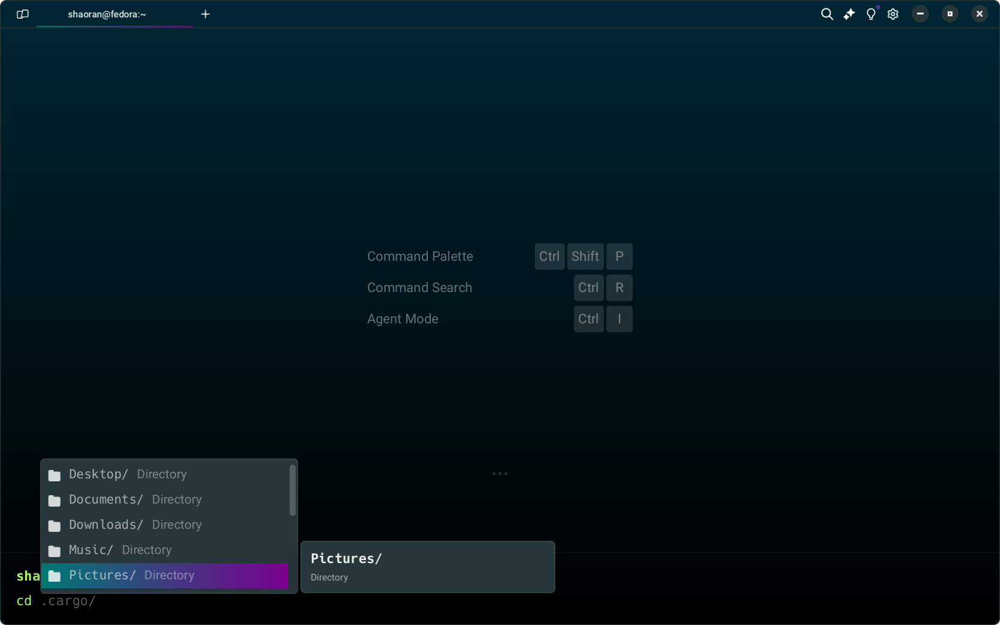
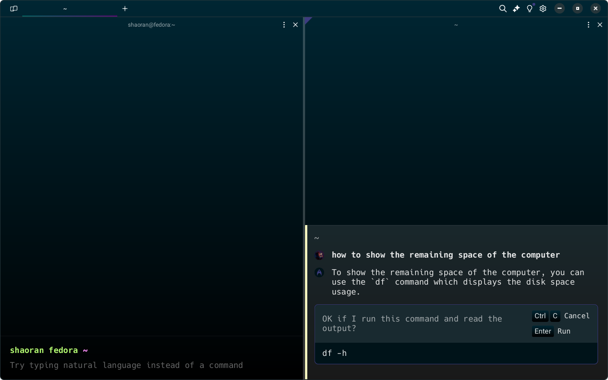
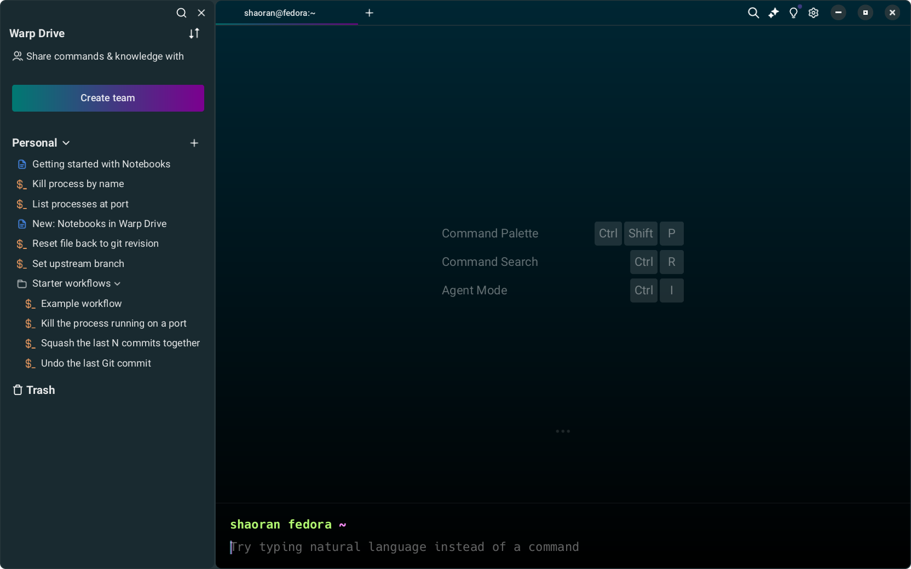

今天 Warp 终于发布了 Linux 版本，这是一个用 Rust 编写的终端，同样使用 GPU 加速。Warp 自称 "The terminal for the 12th century"，设计非常的现代、美观，还自带了 AI 功能。之前只有 MacOS 版本，今天发布了 Linux 版本，并且 Windows 版本一直在开发过程中。

我第一时间体验了一下，确实美观而且功能强大。有自带的语法高亮，命令提示符主题，自动补全，自动的命令建议（fish-like autosuggestions），历史命令搜索，Vim 模式等等。Warp 有一个“工作流功能”，可以将命令作为“工作流”，指定一些变量，调用工作流时输入变量执行即可。Warp 还有团队功能，可以建立加入团队，在团队中发布、共享工作流。至于 AI 功能，在 Warp 中可以向 AI 询问应该使用什么命令，比通过搜索引擎搜索更加高效，目前看来还挺好用的。Warp: Your terminal, reimagined我第一时间体验了一下，确实美观而且功能强大。有自带的语法高亮，命令提示符主题，自动补全，自动的命令建议（fish-like autosuggestions），历史命令搜索，Vim 模式等等。Warp 有一个“工作流功能”，可以将命令作为“工作流”，指定一些变量，调用工作流时输入变量执行即可。Warp 还有团队功能，可以建立加入团队，在团队中发布、共享工作流。至于 AI 功能，在 Warp 中可以向 AI 询问应该使用什么命令，比通过搜索引擎搜索更加高效，目前看来还挺好用的。

综合来说，Warp 是一个更加现代的终端，无论是从界面和外观上看，还是从工作流、AI 等功能上来看。并且开箱即用很多诸如语法高亮、命令建议这样的在其他终端中一般需要一些时间进行配置的功能，值得尝试使用。不过，相对来说，Warp 的可配置性没有 Wezterm 和 Kitty 这样的终端这么高，并且似乎不支持连字，而且在开始使用前要先登陆（Google 或者 Github 账号）。

