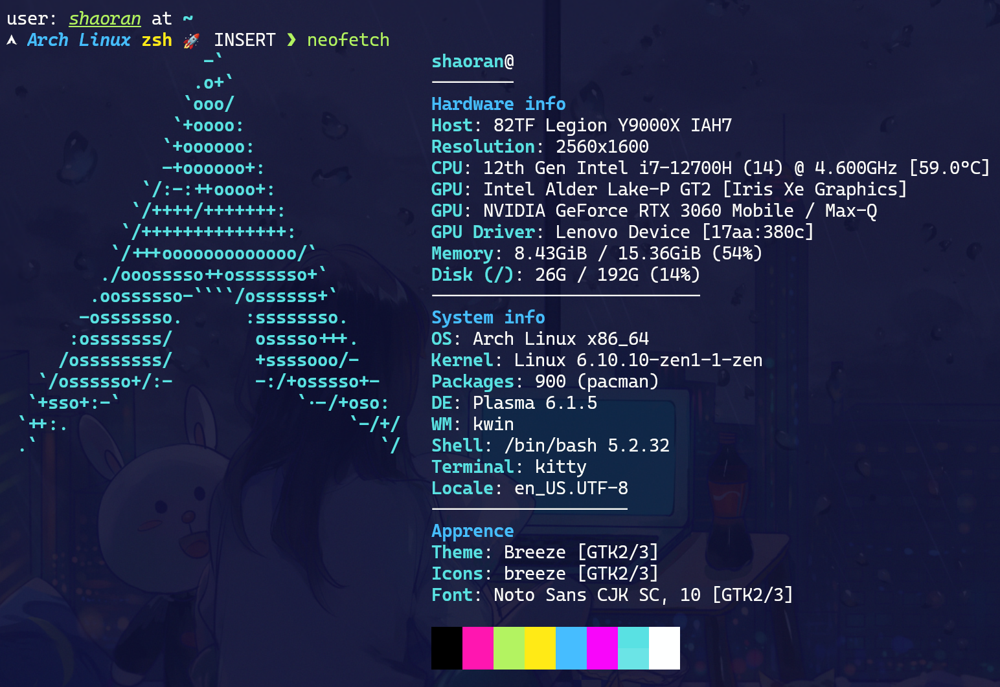

## 安装前的系统配置



## 安装 Hyprland

直接通过 pacman 安装 Hyprland：

```terminal
sudo pacman -S hyprland
```

安装完成之后，顶部会显示配置文件是自动生成的提示，把配置文件 `~/.confi/hypr/hyprlnd.conf` 中 autogenerated 的那一行删掉就可以。

## 一些基本配置

### 设置 mod 键

默认的 mod 键为 SUPER（windows键），我将它修改为 ALT 键。

```config
$mainMod = ALT
```

### 应用程序启动器

使用 `rofi` 应用程序启动器：

```terminal
sudo pacman -S rofi-wayland
```

修改配置文件：

```config
$menu = rofi -show drun
```

可以使用 `rofi-theme-selector` 选择主题，在配置文件 `~/.config/rofi/config.rasi` 中添加以下内容可以显示图标：

```config
configuration {
    show-icons: true;
  }
```

### 状态栏

使用 `waybar` 状态栏：

```terminal
sudo pacman -S waybar
```

修改配置文件：

```config
exec-once = waybar
```

配置 `waybar` 外观：

### 壁纸

使用 `hyprpaper` 配置壁纸：

```terminal
sudo pacman -S hyprpaper
```

编写 hyprpaper 配置文件`~/.config/hypr/hyprpaper.conf`：

```config
preload = /home/shaoran/Pictures/wallpaper/19.jpg
wallpaper = , /home/shaoran/Pictures/wallpaper/19.jpg
```

### 输入法

我已经在系统中安装和配置好了 Fcitx5 输入法（fcitx5-rime + [雾凇拼音](https://github.com/iDvel/rime-ice)），所以直接配置 Hyprland 自动启动 Fcitx5 就可以。

在配置文件中添加：

```config
exec-once=fcitx5 --replace -d
```

### 缩放

缩放比例不等于1时，如 Chrome，VSCode 等 xwayland 上的软件会出现模糊的情况，暂时的解决方案是对 xwayland 强制禁用缩放：

```config
xwayland {
  force_zero_scaling = true
}
```

然后对 xwayland 单独设置缩放：

```config
exec-once = echo 'Xft.dpi:144' | xrdb -merge
```

### 触控板

启用自然滚动和通过触控板手势切换工作区：

```terminal
# https://wiki.hyprland.org/Configuring/Variables/#input
input {
    kb_layout = us
    kb_variant =
    kb_model =
    kb_options =
    kb_rules =

    follow_mouse = 1

    sensitivity = 0 # -1.0 - 1.0, 0 means no modification.

    touchpad {
        natural_scroll = true
    }
}

# https://wiki.hyprland.org/Configuring/Variables/#gestures
gestures {
    workspace_swipe = true
    workspace_swipe_distance = 200
}
```

### 亮度调节

安装 `brightnessctl` 软件包后默认配置即可通过亮度调节按钮进行调节。

```terminal
sudo pacman -S brightnessctl
```

### 通知

安装 `mako` 用来显示通知：

```terminal
sudo pacman -S mako
```

安装 `toastify` 用来从命令行发送通知：

```terminal
sudo pacman -S toastify
```

对于当程序需要提升到 root 权限，所弹出输入密码窗口的服务，可以使用 KDE 的 `polkit-kde-agent`。由于我的电脑上已经安装了 KDE，所以直接启动相关服务即可。

在配置文件中添加：

```config
exec-once = systemctl --user start plasma-polkit-agent
```

### 截图

安装 `grim` `slurp` 软件包：

```terminal
sudo pacman -S grim slurp
```

在配置文件中添加：

```config
$screenshot = grim -g "$(slurp)"
bind = $mainMod , Print, exec, $screenshot
bind = $mainMod Shift, P, exec, $screenshot
```

选择截图之后，截图会存储在 `~/Pictures/`

### XDG Desktop Portal

安装 XDG Desktop Portal 和 File Picker：

```terminal
sudo pacman -S xdg-desktop-portal-hyprland xdg-desktop-portal-gtk
```

## 键位配置

### 添加 vim-like 键位

```config
bind = $mainMod, l, movefocus, l
bind = $mainMod, h, movefocus, r
bind = $mainMod, k, movefocus, u
bind = $mainMod, j, movefocus, d
```

### 配置切换前一个和后一个工作区的键位

```config
bind = $mainMod Ctrl, H, workspace, e-1
bind = $mainMod Ctrl, L, workspace, e+1
bind = $mainMod Ctrl, left, workspace, e-1
bind = $mainMod Ctrl, right, workspace, e+1
```

### 配置移动当前窗口到前一个和后一个工作区的键位

```terminal
bind = $mainMod Shift, H, movetoworkspace, -1
bind = $mainMod Shift, L, movetoworkspace, +1
bind = $mainMod Shift, left, movetoworkspace, -1
bind = $mainMod Shift, right, movetoworkspace, +1
```

## 最终效果


```

```
