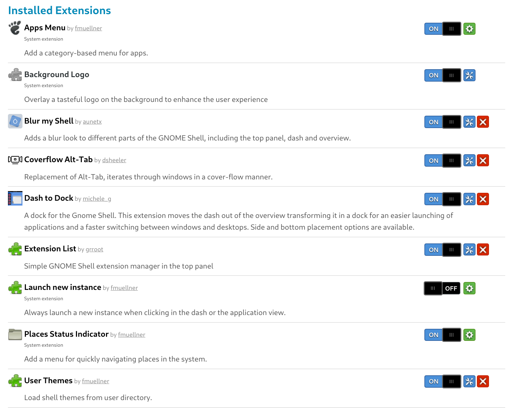
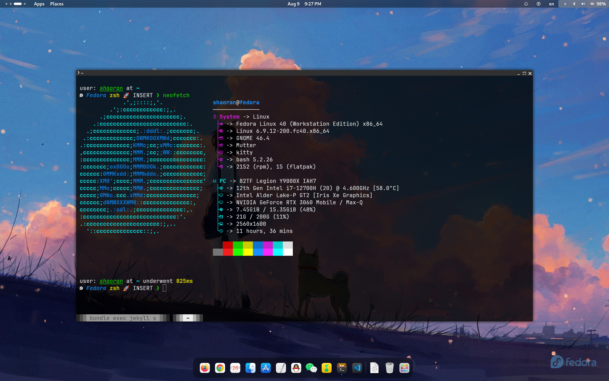

## Fedora

我原本的环境是 win11 + wsl2(Ununtu22.04LTS)，但后来发现 wsl 在某些时候的启动和响应速度还是会比较慢，一开始我以为是 Ubuntu 太“重”了，于是换了 Debian，但并没有立竿见影的改善。再加上 wsl 每次开启和关闭代理都要重启，以及有的软件比如终端模拟器要装在 windows 上，导致配置文件很难找，还有其他的一些不方便。种种原因结合之下，我决定还是装双系统。

其实我之前装过双系统，当时还是 Ubuntu20.04LTS 刚发布的时候，装了 Ubuntu。但当时对 Linux 并不太熟悉，在 Linux 下用着 vscode 和 idea 写代码，并没有感觉到除了配置环境外的特别的优势，后来渐渐就基本只打开 windows 了。后来换了新电脑，就没有装双系统。但现在已经发现了命令行和 vim 的魅力，Linux 已经成为了刚需。

在发行版的选择上，我很是纠结过一段时间。由于受够了 Ubuntu 的老旧的软件源以及其他一些问题，连带着我对整个 Debian 系的发行版都有一种莫名的排斥（虽然我听说 Debian 很好，但我的个人喜好就决定了我不想用这一系的发行版），而且由于我是打算把 Linux 作为主力操作系统来使用的，我也并不想使用那些相对用户没有那么多的小众一点的发行版。于是最后我的选择就只剩下了 Arch 和 Fedora。

一开始我打算装 Arch，毕竟它声名在外，ArchWiki 也真的很好。我安装时发现不能识别网卡，靠着手机 USB 共享热点装好了，然后发现后面还有着浩大的工程，要装一堆驱动，桌面系统，等等。前面我已经在 Neovim 配置，终端和 shell 的配置上折腾了很久了，现在还要花很多时间在系统上，总有种负罪感。接着我又发现我很多倾向的配置就是 Fedora 的配置，而且 Fedora 也足够新，基本会第一时间用上新技术和软件的新版本，同时相对会更加稳定，那就用 Fedora 不就行了？

于是我就装了 Fedora，然后发现安装异常简单，甚至比 Ubuntu 更加方便，驱动都不用操心，用起来也非常顺手，dnf 的软件源都很新，gnome 原装桌面就非常符合我的审美和使用习惯。最近折腾了很多工具的配置，已经多少有点心累了，这时候来了一个开箱即用而且用的很爽的系统，直接让我的好感噌嶒涨。不出意外后面应该会在 Fedora 安定一段时间了，后面再有时间精力再去折腾 Arch 和平铺窗口管理器什么的吧。

注：

- win11 和 Linux 的双系统需要把 windows 的快速启动关掉再装 Linux，否则装好 Linux 后只要进入一次 windows，后面即使从 Linux 启动也会直接进入 windows。

- 现在的 Linuxqq 是真的好用，几乎和 windows 下的没区别。

- 微信，qq 音乐和腾讯会议都可以在 flathub 里找到，通过 Fedora 的软件商店内可以直接下载安装，同样也很好用。

- 有的软件和使用了微软字体的文件会出现汉字显示为方块的问题，把 windows 中 C://Windows/Fonts 中的字体文件复制到 ~/.local/share/fonts/ 内就可以解决。

- 建议安装 fcitx 输入法，比默认的 ibus 更加好用。可以安装 gnome 插件 Input Method Panel 来解决外观问题。

- 这是我使用的一些 Gnome 插件：

- 我还使用了 Github 上的[图标主题](https://github.com/vinceliuice/WhiteSur-icon-theme)，[gtk 主题](https://github.com/vinceliuice/WhiteSur-gtk-theme)以及[grub 主题](https://github.com/vinceliuice/grub2-themes)。

## shell 的配置

我原先使用的配置是 zsh + oh-my-zsh + powerlevel10k，但是经常会发生输入卡顿，可能是因为 oh-my-zsh 太“重量级”了。正好在 github 上看到一个轻量级的 zsh 插件管理器 [Zinit](https://github.com/zdharma-continuum/zinit)，就拿来尝试了一下，效果挺不错的。可以安装 github 上的众多插件，也可以用简单的配置安装 oh-my-zsh 的插件和 library，更新也很方便，还有一些其他的功能，具体可以参考[官方说明](https://zdharma-continuum.github.io/zinit/wiki/INTRODUCTION/)。Zinit 比 oh-my-zsh 更加灵活，速度更快，就是配置的时候会略显复杂，我还没有完全发挥它的功能。

主题我使用的是 [Starship](https://starship.rs/)，根据官方说明安装非常方便，要启用的话在 shell 的配置文件加上一行就行，速度也非常快。

我的 .zshrc 配置[在这里](https://github.com/tea-in-the-snow/terminal-configuration/blob/main/zsh/zshrc)。

## WezTerm

我原先一直使用的终端模拟器是 Alacritty，后来发现了一个新的项目 [WezTerm - Wez's Terminal Emulator](https://wezfurlong.org/wezterm/)。它与 Alacritty 在一些方面很相似，都使用 RUST 进行编写，都基于 GPU 进行加速，都支持 Windows, MacOS, Linux 三个平台。但 WezTerm 拥有更多的功能和特性，以及更强的可定制性。和 Alacritty 相比，它的文档更加全面而详细。WezTerm 的配置文件用的是 Lua，Neovim 的用户应该会觉得特别亲切。

这实际上是两个项目不同的设计思路的体现。Alacritty 设计者就表示，很多功能（比如 tab 和 split）在 Alacritty 中不会被实现，因为他们认为这是其他工具比如窗口管理器或者说终端复用器的功能，而不应该是 GUI 终端模拟器的功能。而 WezTerm 则在保证性能的基础上不吝于添加各种功能，下面是开发者 Wez 本人的一段话：

> My perception of Alacritty is:
>
> - Hyper-focused on speed above function, with relatively minimal feature set as a result.
> - Their default disposition is to not accept features in order to maintain their performance baseline.
>
> My philosophy/motivation for wezterm is:
>
> - I'm a programmer and I want a programmers terminal
> - I use multiple operating systems and I want my terminal to behave consistently across them
> - I want it to look good and feel fast for the things that matter most: interactive latency, rather than raw throughput
> - I'm sick of terminal emulation mismatches that prevent basic things like italic/underline/true color attributes from working when eg: using remote tmux + mosh, so the multiplexing feature in wezterm exists to eliminate that problem

在使用了一段时间的 WezTerm 后，我打算将 WezTerm 作为我的主力终端，这是我的[配置文件](https://github.com/tea-in-the-snow/terminal-configuration/blob/main/wezterm/wezterm.lua)。不过，需要注意的是，WezTerm 对内存的占用明显比 Alacrity 更高（但是速度上没有什么太大差别）。

## kitty

在 Fedora 更新到 Fedora40 之后，Wezterm 的 GUI 出现了一些问题，再加上我在使用过程中总是会发现各种各样的小问题（很多会在短时间内的下一个更新中解决），于是打算换一个终端模拟器体验一下——声名在外的 kitty。

kitty 虽然不是 rust 编写的，但是根据我的体验，速度和 Wezterm 这样用 rust 写的终端模拟器速度没有明显差别，甚至感觉 kitty 要更快一点。（不知道是不是心理作用，但是我总感觉 Wezterm 越来越慢了）。

kitty的配置也非常丰富，直接按下指定的快捷键就会生成一个配置文件，有着异常详尽的注释，基本上直接对着注释修改就能完成自己的配置了，这是我的[配置文件](https://github.com/tea-in-the-snow/terminal-configuration/blob/main/kitty/kitty.conf)。

## Warp

从 Warp 发行 Linux 版本以来，我就一直是它的忠实用户。不过对我来说它一直处于一个“副终端”的位置，偶尔兴之所至或者有一些比较合适的场景用一用。一方面，它和 Linux 适配的并没有么好；另一方面，我还是更加喜欢 wezterm 和 kitty 这样相对传统的，具有高度可定制性的终端，我觉得它们有一种 Warp 所没有的“质感”。

## 最终效果展示

