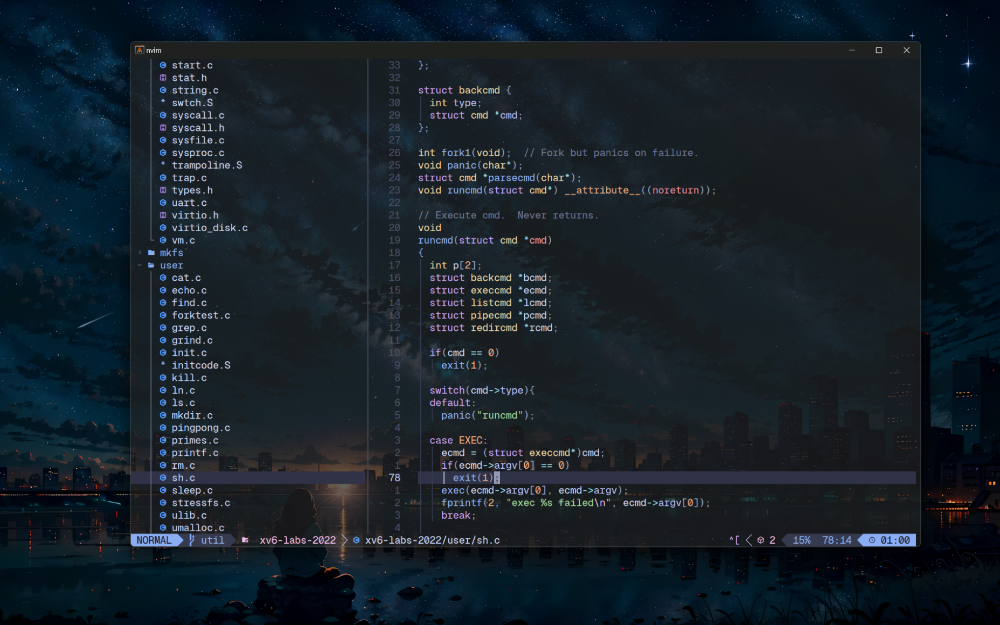

## 写在前面

这次折腾配置的起因是我越来越觉得在敲代码的过程中去抓鼠标和按方向建实在是太不爽了，而 vscode 的 vim 插件又有着诸多的问题，于是打算直接用 vim。

由于打算用 vim 写的大多数都是一些小项目，大型的 Java 项目还得用 idea，所以本来只打算装个 NerdTree，再加上几个小插件就差不多了。但在研究装哪些插件的过程中发现 vim 插件的社区生态简直好到离谱，简直什么样的插件都有，于是激发了我“折腾”的热情，一下配了两天，还顺便浅学了一下途中遇到的 TOML 和 Lua 两种语言。

这些配置当然并不一定能提高开发的效率，即使有提高也未必是立竿见影的。但是对于我这种热爱折腾的人来说配置的过程本身就挺有乐趣的，而且配置完之后，用着配置好的丝滑的工具，即使实际上效率没有提升，感觉上也会像是提升了10倍一样爽。个中享受不足为外人道也。

## Neovim + LazyVim

一开始的时候，我在 Neovim 和 vim 之间犹豫了挺久的，最后还是选择了更加年轻、更加现代的 Neovim。一方面 Neovim 相对来说更有活力，另一方面 Bram 的去世让 vim 的前景变得不那么明朗。

在选定了 Neovim 后，我本打算一个个插件自己组装，但发现 Neovim 有很多集成好的配置，如 SpaceVim, LazyVim 等。最终我选择了 [LazyVim](https://github.com/LazyVim/LazyVim)，可以根据 [LazyVim 主页](https://www.lazyvim.org/) 的文档来进行自己的配置和修改。我的 Neovim 配置在[这个仓库](https://github.com/tea-in-the-snow/neovim-configuration)。

注意：

- 字体要使用 “Nerd Font”，否则可能会导致部分图标不能正常显示。

- LazyVim 需要安装一些相关的依赖，如最基本的 gcc，还有 node.js 等等。可以在 Neovim  中运行 :checkhealth 命令来查看安装是否存在问题。

## Alacritty

我的电脑环境是 Windows11 + WSL2 (Ubuntu22.04LTS) —— 不选择 Mac 是因为电脑除了是生产力工具还是娱乐工具 —— 因此我一直以来都使用的是 windows terminal，并且还算满意。但当我开始使用 Neovim 作为主力开发工具后我发现了一个很严重的问题：在 windows terminal 内使用 vim，块状光标在字符上方时不会自动反色，这会导致部分字符在光标下很难看清。我大概搜索了一下，没有找到很好的解决方案，于是果断抛弃了 windows terminal，转向了号称速度最快的终端模拟器 [Alacritty](https://github.com/alacritty/alacritty)。

Alacritty 的安装并不困难，配置文件现在从 yaml 转为了 TOML。这是我之前没有接触过的语言，简单学了一下，感觉比 yaml 要更加清晰，更适合用来编写配置文件。对 Alacritty 的配置可以参考 Github 上提供的[说明](https://github.com/alacritty/alacritty/blob/master/extra/man/alacritty.5.scd)，还是很清楚的。

我还选用了 Github 上的一个 Alacritty [主题集合](https://github.com/alacritty/alacritty-theme)用来配置颜色主题。我的 Alacritty 相关配置[在这里](https://github.com/tea-in-the-snow/terminal-configuration)。

## Oh-My-Zsh + Powerlevel10k

终端模拟器配置完成后接下来就是 shell 了。我一直是 [Oh-My-Zsh](https://ohmyz.sh/) 的忠实用户，它有着强大的补全功能和很多配置好的方便的别名等等。

Oh-My-Zsh 是一个 zsh 的配置集合，因此要先安装 zsh，然后再安装 Oh-My-Zsh。安装完成后，再安装 Powerlevel10k。[Powerlevel10k](https://github.com/ohmyzsh/ohmyzsh) 是一个 Oh-My-Zsh 的主题，在 Github 上的 star 数已经超过了40k，可以说是相当可观了。我甚至怀疑大多数 zsh 的用户使用的都是 Oh-My-Zsh 和 Powerlevel10k 再加上自己的配置。

根据 Github 上的指导安装完 Powerlevel10k 之后，重新启动 zsh 时会弹出交互式配置界面，此时只需要根据自己的喜好进行一系列问题的回答即可将主题设定为最佳形态。

- 注意：终端的字体同样推荐使用 "Nerd Font"，否则可能会导致部分图标不能正常显示。

## 最终效果

